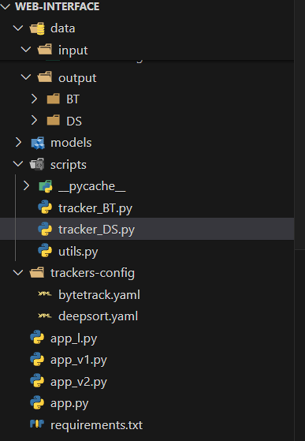
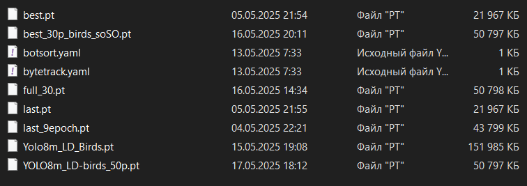
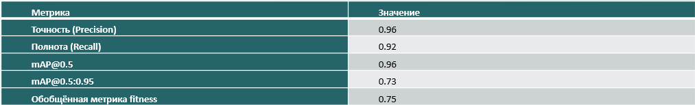
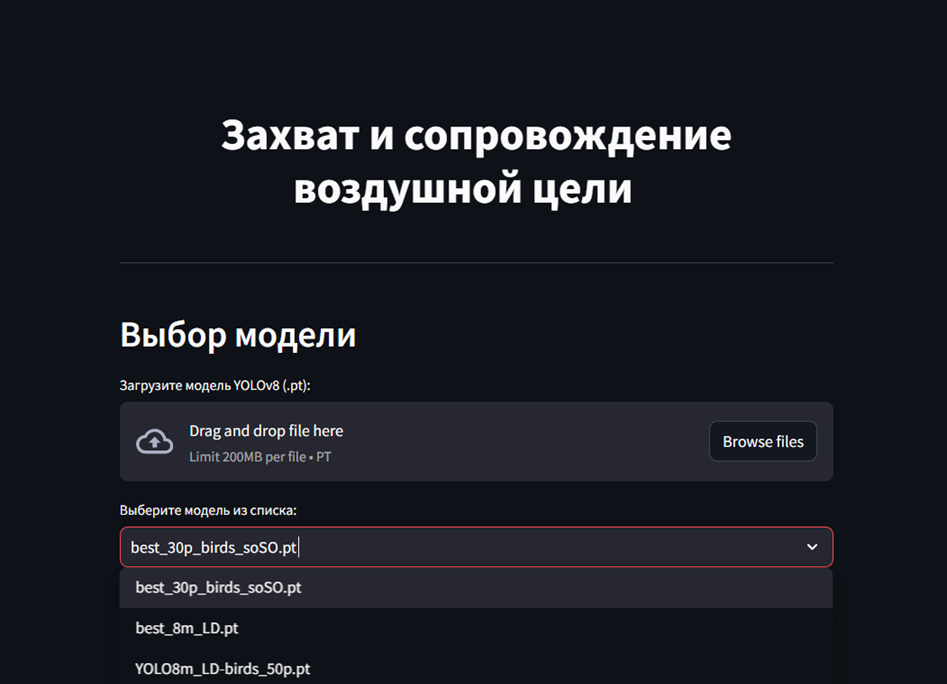
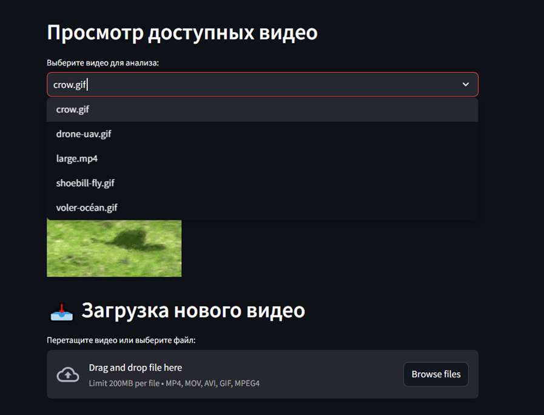
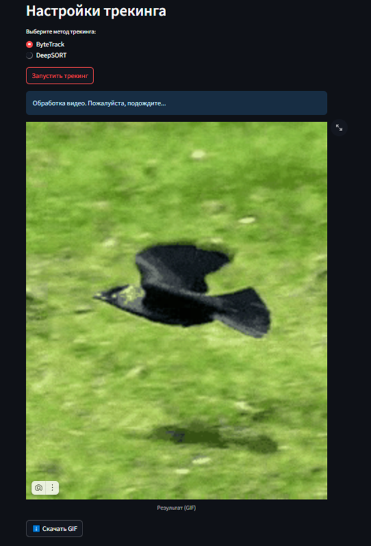

# ВКР — Захват и сопровождение воздушной цели (CV + Tracking)

**Цель работы.** Разработка и исследование программного решения для автоматического захвата и сопровождения воздушной цели на видеопотоке:

-   анализ методов и подбор данных;
-   выбор и обоснование алгоритмов;
-   обучение модели детекции;
-   тестирование трекинга (ByteTrack, Deep SORT);
-   программная реализация с веб-интерфейсом (Streamlit).

---

## Репозиторий и структура

-   `Web-interface/` — приложение Streamlit.
    <p align="center"></p>

-   `notebooks/` — эксперименты по обучению/валидации (очищенные от вывода).
-   `trackers-config/` — конфиги трекеров (пороги, σ и т.п.).
-   `results/`, `raw/`, `videotests/` — примеры и артефакты экспериментов.
-   `models/` — **веса не хранятся в Git** (см. иллюстрацию структуры).
    <p align="center"></p>

> Крупные датасеты и видео исключены `.gitignore`.

---

## Методология

### Детекция (YOLO family)

-   Одношаговый детектор (CNN-бэкбон + FPN + детекционные головы).
-   Выход: \((x, y, w, h, p*\text{cls}, p*\text{obj})\).
-   Пост-обработка: NMS Ultralytics.
-   Метрики: mAP@{.5,.5:.95}.

### Трекинг 1 — **ByteTrack**

-   Идея: ассоциировать **и высоко-, и низкоскорные** детекции.
-   Шаги:
    1. high-score детекции -> сопоставление с треками по IoU (Венгерский алгоритм);
    2. оставшиеся треки сопоставить с low-score детекциями;
    3. обновить/создать/убить треки.


### Трекинг 2 — **Deep SORT**

-   Kalman Filter (линейная модель состояния bbox) + Hungarian.
-   Визуальные признаки (ReID-эмбеддинги) -> косинусная схожесть.
-   Комбинированная стоимость
-   KF: предсказание/обновление стандартными уравнениями.


## Результаты (итоговые)

-   Детектор обучен на профильном датасете собранном из открытых истоников, подобраны пороги NMS/score (yaml конфигурационные файлы).
-   Сравнение трекеров: ByteTrack против Deep SORT на видеотестах.
-   Итоговые метрики сведены в таблицу:
    <p align="center"></p>

---

## Веб-интерфейс

Интерфейс реализован на **Streamlit** (папка [`Web-interface`](./Web-interface)):

-   загрузка видео;
-   выбор трекера (ByteTrack / Deep SORT);
-   визуализация bbox, ID треков, FPS/метрик;
-   сохранение результата в формате gif для сокращения объема файла.

<p align="center"></p>
<p align="center"></p>
<p align="center"></p>

### Запуск локально

```bash
cd Web-interface
pip install -r requirements.txt
streamlit run app_l.py
```
